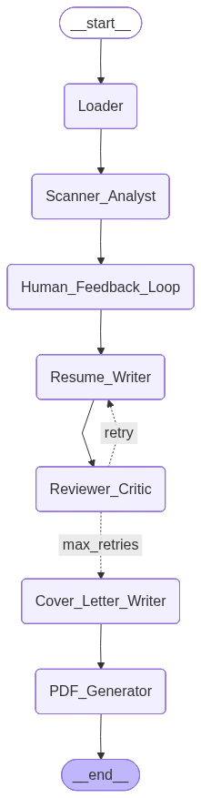

# Self-Refining Resume Optimizer Agent

## Project Overview

This project implements a sophisticated **Agentic Workflow** that mimics a professional writer/editor relationship. It goes beyond simple text generation by introducing state management, user feedback loops, and automated document formatting.

### Key Features

* **Universal Loader:** Ingests resumes directly from **PDFs** and Job Descriptions from **Web URLs**.
* **Gap Analysis:** Identifies exactly which skills (e.g., "SQL", "CI/CD") are missing from your profile.
* **Human-in-the-Loop:** Pauses the workflow to ask you for context (e.g., *"You are missing SQL. Do you have this experience?"*) before writing.
* **Self-Refinement:** A "Critic" node scores every draft (0-100). If the score is low, the "Writer" node must rewrite it.
* **Professional Outputs:** Automatically generates a **tailored Cover Letter** and exports both documents as CSS-styled **PDFs**.

## Tech Stack

* **Orchestration:** [LangGraph](https://langchain-ai.github.io/langgraph/) (Cyclic State Management)
* **LLM:** `llama-3.3-70b-versatile` (via Groq API) for high-speed, low-cost inference.
* **Interface:** **Gradio** (Web UI for PDF uploads and interactive feedback).
* **Data Processing:** `PyPDF` (Document Parsing) & `WebBaseLoader` (Scraping).
* **Validation:** Pydantic (Structured Output).
* **Output Engine:** `markdown`& `xhtml2pdf`  (Rendering CSS-styled documents).

## How It Works (The Graph)



The system is modeled as a State Graph with a specific multi-stage execution flow::

| Node | Role | Behavior |
|------|------|----------|
| **Loader** | Ingestor | Extracts raw text from PDF files or Job URLs. |
| **Scanner** | Analyst | Compares Job vs. Resume and outputs a list of "Missing Skills". |
| **Human Loop** | Manager | **Stops execution** to let the user add context/experience for the missing skills. |
| **Improver** | Writer | Rephrases the resume using the user's notes. **Constraint:** Never hallucinates experience. |
| **Reviewer** | Judge | Acts as a Hiring Manager. Returns a `Score` (0-100) and specific `Feedback`. |
| **Cover Letter**| Author | Uses the finalized resume and job text to write a cohesive cover letter. |
| **PDF Exporter**| Publisher| Renders the final Markdown text into professional PDFs with custom styling. |

### The "Loop" Logic

* **Conditional Edge:** After the Reviewer node, the system checks the `Score`:
  * `Score > 85`: **Exit** (Success)
  * `Score < 85`: **Loop Back** to Improver (carrying the critique).
  * `Max Iterations (3)`: **Exit** (Prevent infinite loops).

---

## Experiment: Self-Correction in Action

In a recent test run, the agent demonstrated its ability to handle a "Junior" resume applying for a generic Data Scientist role without hallucinating fake experience.

**Scenario:**

* **Missing Skills Found:** Pandas, Machine Learning concepts, NLP.
* **User Action:** The user provided **no additional context** (simulating a lack of experience).

**The Self-Correction Log:**

1. **Iteration 1 (Score: 60/100):**
    * *Critic's Feedback:* "Candidate needs to highlight practical application of Python/Pandas... and explain how they plan to acquire NLP skills."
    * *Action:* The Writer rewrote the summary to emphasize academic exposure.
2. **Iteration 2 (Score: 80/100):**
    * *Critic's Feedback:* "Better, but still lacks direct experience with NLP which is crucial."
    * *Action:* The Writer pivoted strategy. Instead of claiming experience, it highlighted the candidate's "solid foundation" and explicitly mentioned "dedicating self to practical applications" and "online coursework" to address the gap honestly.
3. **Iteration 3 (Score: 90/100):**
    * *Critic's Verdict:* "Strong match... successfully highlights willingness to learn."
    * *Result:* **Success.**

**Key Takeaway:** The agent successfully navigated a "skills gap" not by lying, but by reframing the candidate's potential and academic focus to satisfy the strict Critic node.

---

## Usage

### Prerequisites

* Python 3.9+
* Groq API Key (Free tier available)

## Running the App

### 1. Install Dependencies

1. **Install dependencies:**

   ```bash
   pip install -r requirements.txt

2. **Set your API key in ```bash resume_agent.py```:**

   ```bash
   os.environ["GROQ_API_KEY"] = "your_key_here"

3. **Launch the App:**

   ```bash
   python app.py

